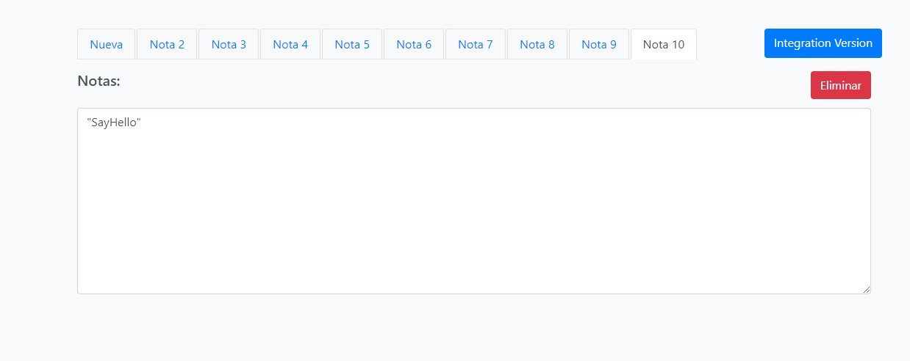

# Front-End APP PROJECT

## Tabla de Contenidos

- [Front-End APP PROJECT](#front-end-app-project)
  - [Tabla de Contenidos](#tabla-de-contenidos)
  - [Preview](#preview)
    - [Screenshot](#screenshot)
  - [Proyecto](#proyecto)
  - [Proceso](#proceso)
    - [Construido con:](#construido-con)
    - [Recursos Utilizados](#recursos-utilizados)
- [Instrucciones para Ejecutar el Proyecto](#instrucciones-para-ejecutar-el-proyecto)
  - [Requisitos Previos](#requisitos-previos)
  - [Configuración del Proyecto](#configuración-del-proyecto)
    - [1. Clonar el Repositorio.](#1-clonar-el-repositorio)
    - [2. Cambia al directorio del proyecto.](#2-cambia-al-directorio-del-proyecto)
    - [3. Instalar dependencias.](#3-instalar-dependencias)
    - [4. Ejecutar la Aplicación](#4-ejecutar-la-aplicación)

## Preview

### Screenshot



## Proyecto

Este proyecto es una aplicación Front-End que permite la gestión de notas.

## Proceso

### Construido con:

- **Front-end**:
  - Node.js (v16)
  - React (v17)
  - Axios (v1.3)
  - Redux (v3.7)
  - Bootstrap (v4)
  - Vite.js (v5)
  - Vistual Studio Code

### Recursos Utilizados

Para el desarrollo de este proyecto se utilizaron los siguientes recursos:

- [React](https://es.reactjs.org/)
- [Redux](https://redux.js.org/)
- [Bootstrap](https://getbootstrap.com/)
- [Node.js](https://nodejs.org/en/)
- [Vite.js](https://vitejs.dev/guide/)
- [Visual Studio Code](https://code.visualstudio.com/)

# Instrucciones para Ejecutar el Proyecto

Este proyecto es una aplicación front-end desarrollada con React. Cuenta con 2 versiones. La primera es la que sale de forma principal donde puedes crear hasta 10 notas.

La segunda versión se activa al dar Clic en el botón `` Integration version `` y al ingresar una clase de Java permite describir los atributos y las firmas de los métodos que contenga la clase pública. 

Para usar la primera version del ejercicio front-end basta realizar los siguientes pasos en tu entorno de desarrollo local:

## Requisitos Previos

Antes de comenzar, asegúrate de tener instalado **[Node.js](https://nodejs.org/)** en tu sistema. Este proyecto requiere **Node.js versión 14.x o 16.x** y utiliza `npm` (Node Package Manager) para gestionar las dependencias.

## Configuración del Proyecto

### 1. Clonar el Repositorio.

Clona este repositorio a tu máquina local utilizando el siguiente comando de Git:

```bash
git clone https://github.com/YhonaPeguero/FullStack-Front-End-Integration
```

### 2. Cambia al directorio del proyecto.

Clona este repositorio a tu máquina local utilizando el siguiente comando de Git:

```bash
cd FullStack-Front-End-Integration
```

### 3. Instalar dependencias.

Una vez que estés en el directorio del proyecto, instala todas las dependencias necesarias con npm:

```bash
npm install
```

### 4. Ejecutar la Aplicación

Con las dependencias ya instaladas, puedes iniciar la aplicación en modo de desarrollo con el siguiente comando:

```bash
npm run dev
```

Para poder ejecutar la segunda version que esta disponible en la UI al hacer Clic en `` Integration version `` debes seguir los pasos
indicados del siguiente repositorio:

``` https://github.com/YhonaPeguero/FullStack-Back-End-Integration ```