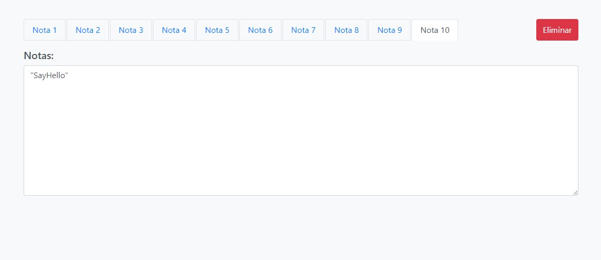

# FULLSTACK APP PROJECT

## Tabla de Contenidos

- [FULLSTACK APP PROJECT](#fullstack-app-project)
  - [Tabla de Contenidos](#tabla-de-contenidos)
  - [Preview](#preview)
    - [Screenshot](#screenshot)
  - [Proyecto](#proyecto)
    - [Links](#links)
  - [Proceso](#proceso)
    - [Construido con:](#construido-con)
    - [Recursos Utilizados](#recursos-utilizados)
  - [Funcionalidades Clave](#funcionalidades-clave)
- [Instrucciones para Ejecutar el Proyecto](#instrucciones-para-ejecutar-el-proyecto)
  - [Requisitos Previos](#requisitos-previos)
  - [Configuración del Proyecto](#configuración-del-proyecto)
    - [1. Clonar el Repositorio.](#1-clonar-el-repositorio)
    - [2. Cambia al directorio del proyecto.](#2-cambia-al-directorio-del-proyecto)
    - [3. Instalar dependencias.](#3-instalar-dependencias)
    - [4. Ejecutar la Aplicación](#4-ejecutar-la-aplicación)

## Preview

### Screenshot



## Proyecto

Este proyecto es una aplicación FullStack que permite la gestión de notas y la descripción dinámica de clases en Java. Implementado como parte de una prueba técnica, demuestra el uso de tecnologías front-end y back-end para crear una solución integrada que abarca desde la interfaz de usuario hasta la lógica de negocio y el procesamiento de datos.

### Links

- Repositorio: [Solution]([text](https://github.com/YhonaPeguero/front-end/master))

## Proceso

### Construido con:

- **Front-end**:
  - Node.js (v16)
  - React (v17)
  - Axios
  - Redux
  - Bootstrap (v4)

- **Back-end**:
  - Java (1.8.0)
  - Maven (3.0.0)

### Recursos Utilizados

Para el desarrollo de este proyecto se utilizaron los siguientes recursos:

- [React](https://es.reactjs.org/)
- [Redux](https://redux.js.org/)
- [Bootstrap](https://getbootstrap.com/)
- [Node.js](https://nodejs.org/en/)
- [Vite.js](https://vitejs.dev/guide/)

## Funcionalidades Clave

- **Front-end**: Creación y gestión de hasta 10 notas con opciones para crear y eliminar.

# Instrucciones para Ejecutar el Proyecto

Este proyecto es una aplicación front-end desarrollada con React. Para ejecutarla en tu entorno de desarrollo local, sigue estos pasos cuidadosamente.

## Requisitos Previos

Antes de comenzar, asegúrate de tener instalado **[Node.js](https://nodejs.org/)** en tu sistema. Este proyecto requiere **Node.js versión 14.x o 16.x** y utiliza `npm` (Node Package Manager) para gestionar las dependencias.

## Configuración del Proyecto

### 1. Clonar el Repositorio.

Clona este repositorio a tu máquina local utilizando el siguiente comando de Git:

```bash
git clone https://github.com/YhonaPeguero/front-end.git
```

### 2. Cambia al directorio del proyecto.

Clona este repositorio a tu máquina local utilizando el siguiente comando de Git:

```bash
cd front-end
```

### 3. Instalar dependencias.

Una vez que estés en el directorio del proyecto, instala todas las dependencias necesarias con npm:

```bash
npm install
```

### 4. Ejecutar la Aplicación

Con las dependencias ya instaladas, puedes iniciar la aplicación en modo de desarrollo con el siguiente comando:

```bash
npm run dev
```
